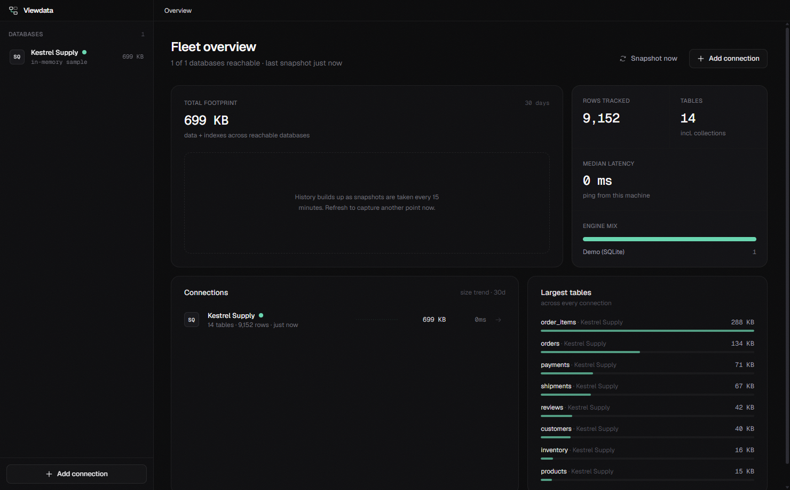
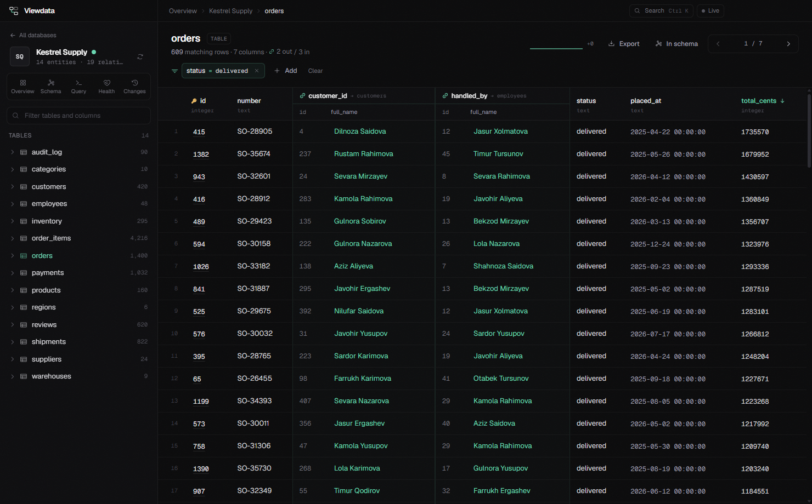
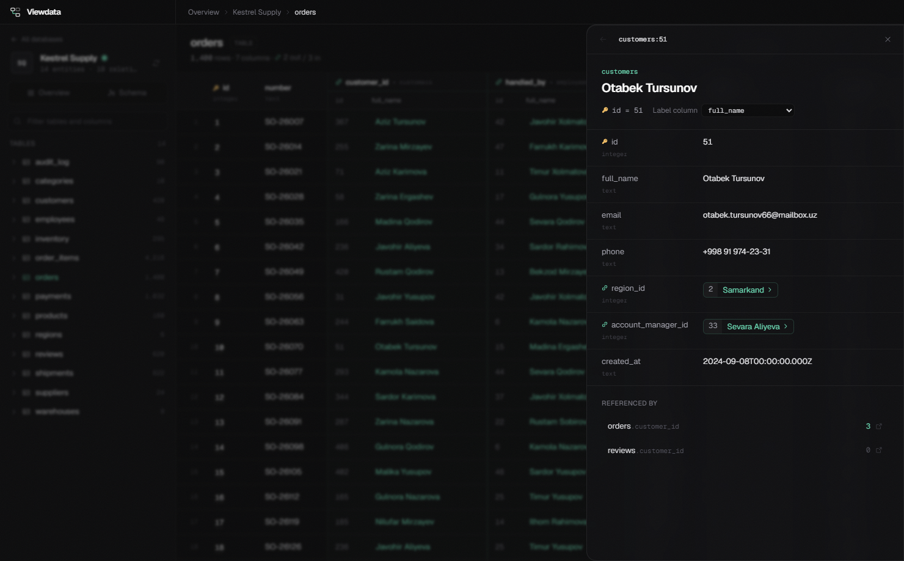
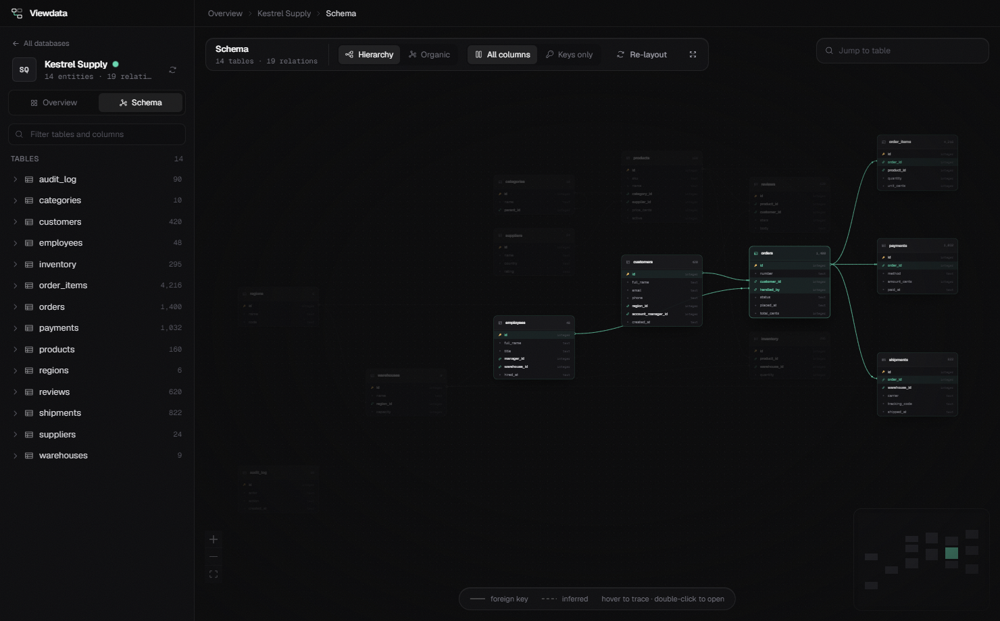
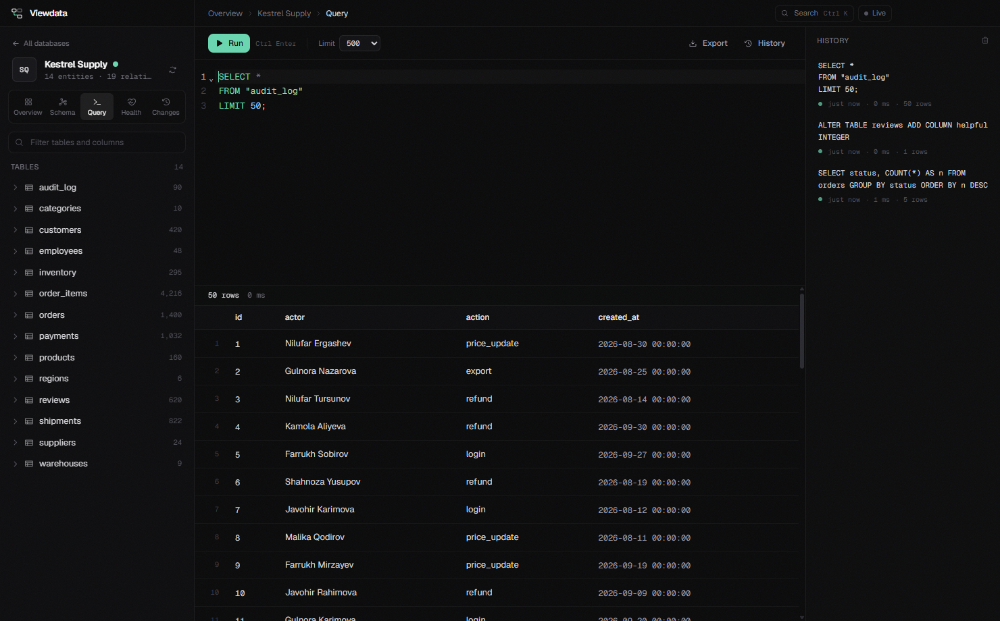
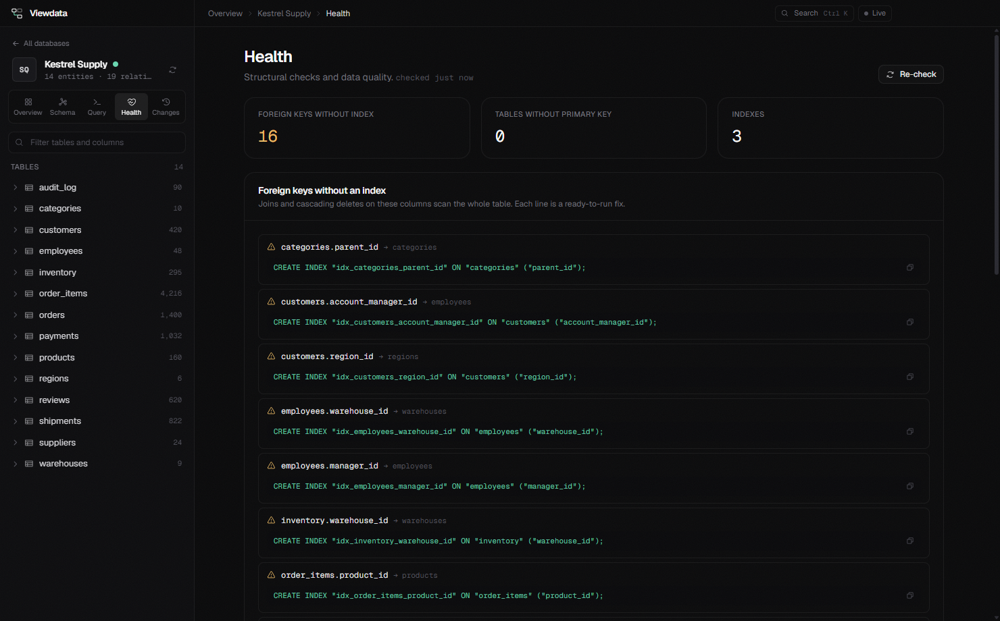
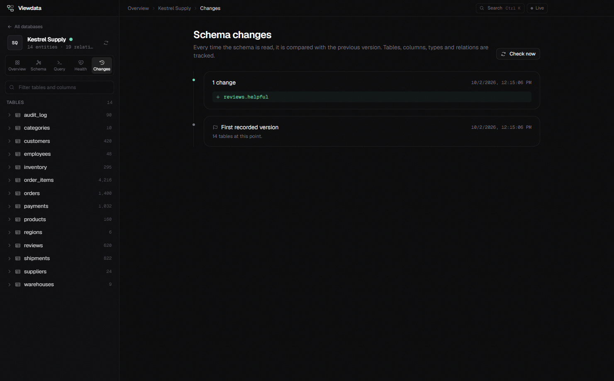
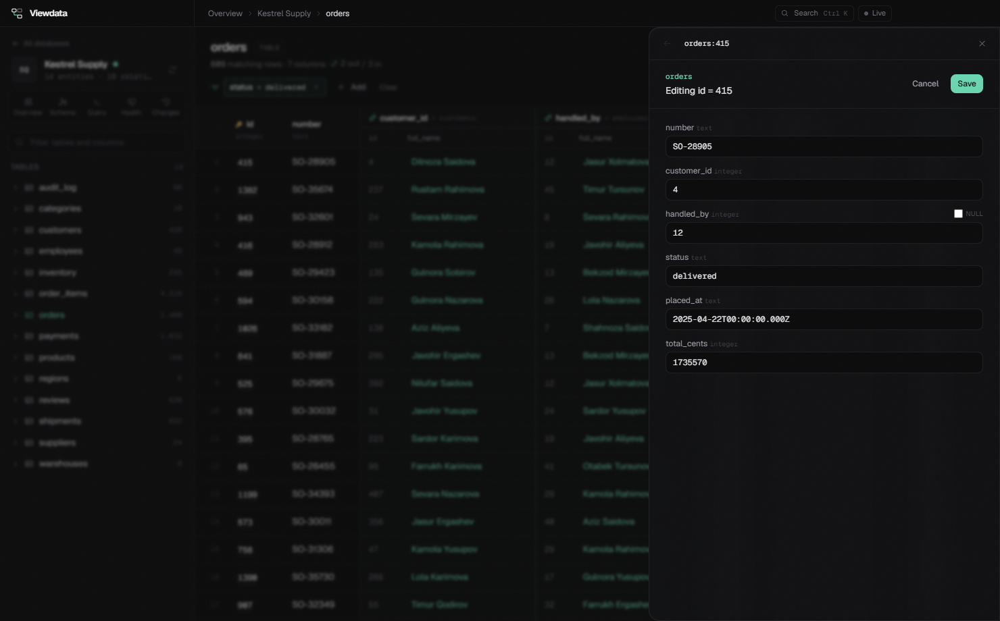
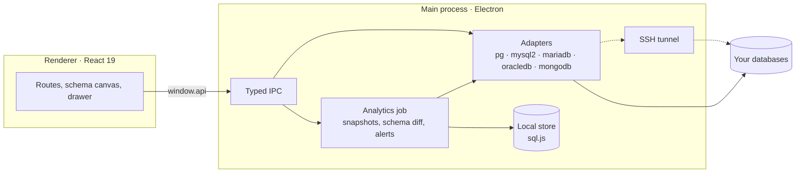

<a href="#">
  
</a>

<p>
  <a href="../../releases/latest"></a>
  <a href="LICENSE"></a>
  
  
  
</p>

<p>
  <a href="../../releases/latest"><b>Download</b></a>
  &nbsp;&middot;&nbsp;
  <a href="#what-it-does">What it does</a>
  &nbsp;&middot;&nbsp;
  <a href="#safe-by-default">Safety</a>
  &nbsp;&middot;&nbsp;
  <a href="#supported-databases">Engines</a>
  &nbsp;&middot;&nbsp;
  <a href="#development">Development</a>
</p>

<br />

Most database clients show you a grid of numbers. Viewdata shows you what those numbers point at.
A `customer_id` column reads as **`[ 4127 ][ Odile Marchetti ]`**, clicking the name slides the customer in from the right,
and the whole schema can lay itself out as a diagram built from the relations, not from alphabetical order.

Underneath, a local job snapshots every connection every 15 minutes, so you can see which databases are growing,
which tables changed shape last night, and which foreign keys have no index.

<br />



<sub>Fleet overview. Every connection with status, latency, size, row counts and growth, refreshed in the background.</sub>

<br />
<br />

## What it does

<table>
  <tr>
    <td width="58%"></td>
    <td width="42%" valign="top">
      <h3>Read rows like sentences</h3>
      <p>Foreign key columns get a two-level header, <code>customer_id &rarr; customers</code>, and cells that show the id next to a human label.</p>
      <p>Filter by any column with <code>=</code>, <code>&ne;</code>, contains, <code>&gt;</code>, <code>&lt;</code> or null checks, and sort by clicking a header. Filters live in the URL, so back and forward just work.</p>
    </td>
  </tr>
  <tr>
    <td width="42%" valign="top">
      <h3>Follow a relation without losing your place</h3>
      <p>Click a referenced name and that row opens in a drawer with its own relations and a <i>Referenced by</i> list.</p>
      <p>Each child link opens the related table already filtered to the current row. Keep drilling for as long as the data goes.</p>
    </td>
    <td width="58%"></td>
  </tr>
  <tr>
    <td width="58%"></td>
    <td width="42%" valign="top">
      <h3>Schemas that arrange themselves</h3>
      <p>Positions come from the relations: ELK layered layout with per-column ports, or a stress-based organic mode. Hubs are placed first and isolated tables are grouped to the side.</p>
      <p>Tables fly in, edges draw themselves, and hovering a table traces every link. Anything you drag is remembered.</p>
    </td>
  </tr>
  <tr>
    <td width="42%" valign="top">
      <h3>Query with the schema in hand</h3>
      <p>SQL with schema-aware autocomplete, or a JSON <code>find</code> / <code>aggregate</code> spec for MongoDB. <kbd>Ctrl</kbd> + <kbd>Enter</kbd> runs it, and every database keeps its own history.</p>
      <p>Results and whole tables export to CSV or JSON. Schemas export to DBML, Mermaid or JSON.</p>
    </td>
    <td width="58%"></td>
  </tr>
  <tr>
    <td width="58%"></td>
    <td width="42%" valign="top">
      <h3>Find the problems before they find you</h3>
      <p>Foreign keys without a supporting index come with a ready <code>CREATE INDEX</code>. Tables without a primary key are flagged.</p>
      <p>The data profile shows null share, distinct counts, most common values and dangling references per column.</p>
    </td>
  </tr>
  <tr>
    <td width="42%" valign="top">
      <h3>See what changed, and when</h3>
      <p>Every schema read is compared with the previous one. Added and dropped tables, new columns, type changes and relations land on a timeline.</p>
      <p>Alert rules cover a failing connection, size above a threshold, or growth beyond a percentage in 24 hours, delivered as native notifications.</p>
    </td>
    <td width="58%"></td>
  </tr>
</table>

### Also in the box

- **Live mode.** One toggle in the title bar keeps tables and stats refreshing every few seconds.
- **Command palette.** <kbd>Ctrl</kbd> + <kbd>K</kbd> jumps to any database, table, page or action.
- **SSH tunnels.** Reach databases behind a bastion with a password or a private key.
- **MongoDB relation inference.** Viewdata samples documents, finds `ObjectId` and `*Id` fields, verifies them against other collections and shows a confidence score for every inferred link.
- **Sample database.** "Kestrel Supply", an in-memory SQLite dataset, lets you try every feature without a server.

<br />

## Safe by default

<table>
  <tr>
    <td width="42%" valign="top">
      <p>Viewdata is built for looking at production data without fear of touching it.</p>
      <ul>
        <li>Queries run inside read-only transactions, behind a keyword guard.</li>
        <li>Rows cannot be edited until you switch on <b>Allow writes</b> for that connection.</li>
        <li>Credentials and SSH secrets are encrypted with the OS keychain through Electron <code>safeStorage</code>.</li>
        <li>No telemetry, no account. Analytics live in a local SQLite file and never leave your machine.</li>
      </ul>
    </td>
    <td width="58%"></td>
  </tr>
</table>

<br />

## Supported databases

| Engine | Driver | Where relations come from |
| :-- | :-- | :-- |
| PostgreSQL | `pg` | declared foreign keys in `pg_constraint` |
| MySQL | `mysql2` | `information_schema.KEY_COLUMN_USAGE` |
| MariaDB | `mariadb` | `information_schema.KEY_COLUMN_USAGE` |
| Oracle | `oracledb` in thin mode | `all_constraints` and `all_cons_columns` |
| MongoDB | `mongodb` | inferred from sampled documents |

Oracle runs in thin mode, so Oracle Instant Client is not required.

## Install

Grab `Viewdata-Setup-x.y.z.exe` from the [latest release](../../releases/latest) and run it.
The installer is self-contained: it ships the Electron runtime and every driver, so there is nothing else to set up.

Windows x64 is the only packaged target today. The code is cross-platform, and a macOS build is on the roadmap.

## Keyboard

| Keys | Action |
| :-- | :-- |
| <kbd>Ctrl</kbd> + <kbd>K</kbd> | Command palette |
| <kbd>Ctrl</kbd> + <kbd>Enter</kbd> | Run the current query |
| <kbd>&uarr;</kbd> <kbd>&darr;</kbd> <kbd>Enter</kbd> | Move through and open palette results |
| <kbd>Esc</kbd> | Close the palette, menus and drawers |

## How it is built



Stack: Electron, electron-vite, React 19, Tailwind CSS 4, Framer Motion, React Flow, ELK.js, TanStack Query, Zustand, sql.js, ssh2.

## Development

```bash
npm install
npm run dev         # app with hot reload
npm run typecheck   # main and renderer
npm run assets      # regenerate icon and installer artwork in build/
npm run dist        # build release/Viewdata-Setup-<version>.exe
```

```
src/
  main/       Electron main process: engine adapters, analytics, alerts, SSH tunnel, SQLite store, IPC
  preload/    typed bridge exposed as window.api
  renderer/   React UI: routes, schema canvas, drawer, query editor, command palette
  shared/     types shared by both sides
```

Adding an engine means implementing one adapter in `src/main/adapters/`. The interface covers schema reads, paged and filtered rows, counts, indexes, queries and row updates, and everything else in the app works on top of it.

## Roadmap

- macOS build (universal, signed) through a GitHub Actions runner
- Saved queries and shareable query links
- More engines: SQL Server and SQLite files on disk

## Contributing

Issues and pull requests are welcome. For anything larger than a fix, open an issue first so we can agree on the shape of it.
Please run `npm run typecheck` before sending a PR.

## License

[MIT](LICENSE)
